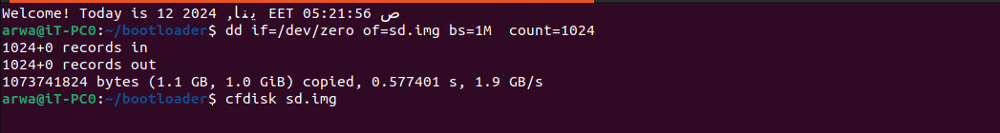
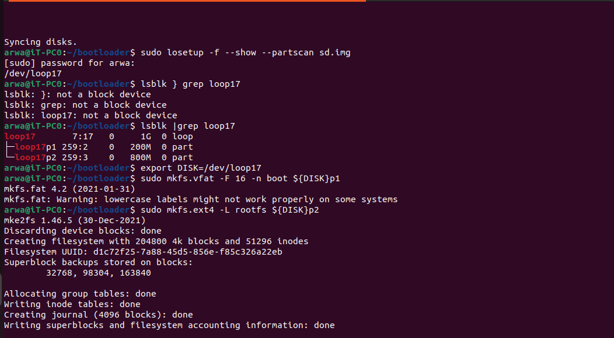
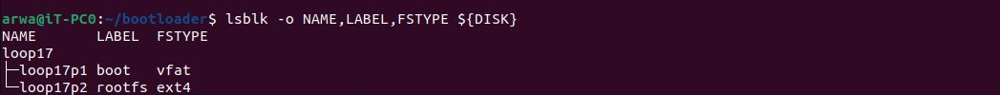

# Creating an SD Image for a Bootloader

To create an SD image for a bootloader, follow these steps:

1. Create an empty SD image file named `sd.img` with a size of 1GB:
    ```bash
    dd if=/dev/zero of=sd.img bs=1M count=1024
    ```

2. Partition the `sd.img` file using `cfdisk`:
    ```bash
    sudo cfdisk sd.img
    ```
    <br> <br>
    


3. Find an available loop device and associate it with the `sd.img` file:
    ```bash
    sudo losetup -f --show --partscan sd.img
    ```

4. Identify the loop device associated with the `sd.img` file:
    ```bash
    sudo losetup -a | grep <loopX>
    ```

5. Verify the loop device and its partitions:
    ```bash
    lsblk | grep <loopX>
    ```

6. Set the `DISK` environment variable to the loop device:
    ```bash
    export DISK=/dev/loop<x>
    ```

7. Format the first partition of the loop device as FAT16 with the label "boot":
    ```bash
    sudo mkfs.vfat -F 16 -n boot ${DISK}p1
    ```

8. Format the second partition of the loop device as ext4 with the label "rootfs":
    ```bash
    sudo mkfs.ext4 -L rootfs ${DISK}p2
    ```

  <br> <br>
    
   <br> <br>

9. Verify the disk and its partitions:
    ```bash
    lsblk -o NAME,LABEL,FSTYPE ${DISK}
    ```

  <br> <br>
    
   <br> <br>

That's it! You have successfully created an SD image for a bootloader using the provided commands. Make sure to replace `<loopX>` with the appropriate loop device number on your system.