# TFTP Server Setup

This guide will walk you through setting up a TFTP server on Ubuntu and configuring it for network booting.

## Installation


TFTP Server Setup
This guide provides step-by-step instructions for setting up a TFTP server on Ubuntu and configuring it for network booting.

Installation
Install the TFTP server package:

```
sudo apt-get install tftpd-hpa
```
<br><br>
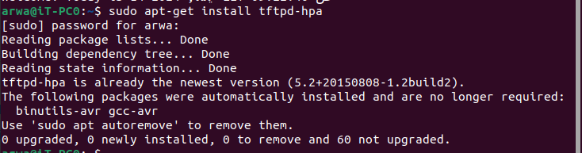
<br><br>

Verify that the TFTP server is running on port 69:

```
sudo ss -tulpn | grep :69
```

<br><br>
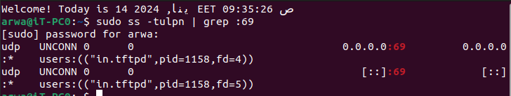
<br><br>
Check the status of the TFTP server:

```
sudo systemctl status tftpd-hpa
```

<br><br>
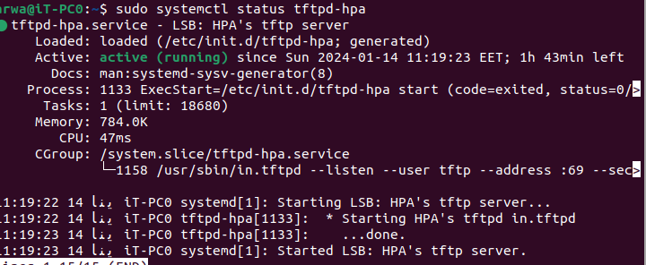
<br><br>
Open the TFTP server configuration file for editing:

```
sudo vim /etc/default/tftpd-hpa
```
<br><br>
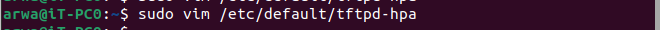
<br><br>
Set the TFTP_OPTIONS to enhance security:

```
TFTP_OPTIONS="--secure --create"
```
<br><br>
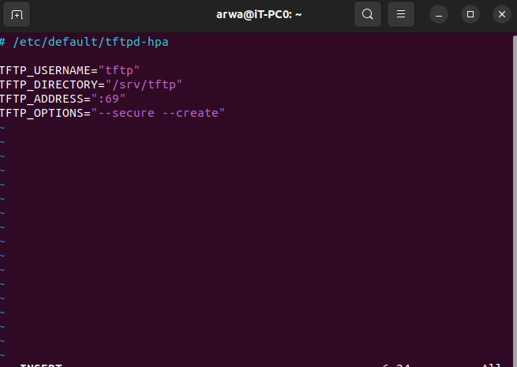
<br><br>
Restart the TFTP server to apply the changes:

```
systemctl restart tftpd-hpa
```

Verify the TFTP server status again:

```
systemctl status tftpd-hpa
```
<br><br>
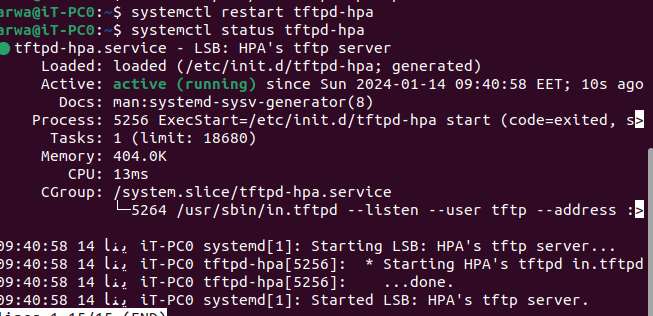
<br><br>
Create a directory for TFTP server files:

<br><br>
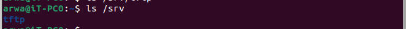
<br><br>
```
mkdir /srv/tftp
cd /srv
chown tftp:tftp tftp
```
<br><br>
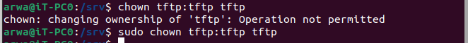
<br><br>
Kernel and Device Tree Configuration
Create a file named Zimage and input the kernel commands:

<br><br>
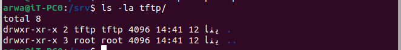
<br><br>
```
sudo vim /srv/tftp/Zimage
# Type the kernel commands inside
```

Create a file named hardware.dtb and input the device tree commands:

```
sudo vim /srv/tftp/hardware.dtb
# Type the device tree commands inside
```

Obtain the server's IP address:

```
ip addr
```
<br><br>
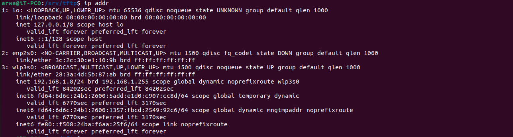
<br><br>
QEMU Configuration
Create a script named qemu-ifup:

```
#!/bin/sh
ip a add 192.168.1.15 dev $1
ip link set $1 up
chmod +x qemu-ifup
```

Run QEMU to emulate the ARM system:

```
sudo qemu-system-arm -M vexpress-a9 -m 128M -nographic -kernel path/u-boot -sd path/sd.img -net tap,script=./qemu-ifup -net nic
```
<br><br>
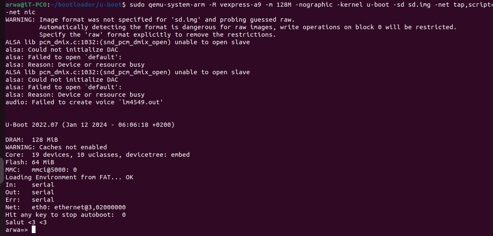
<br><br>
U-Boot Configuration
Access U-Boot prompt:

```
setenv serverIP 192.168.1.1
setenv IPaddr 192.168.1.16  
setenv kernel_address 0x60000000
setenv fdt_address 0x60000020
saveenv
```

<br><br>
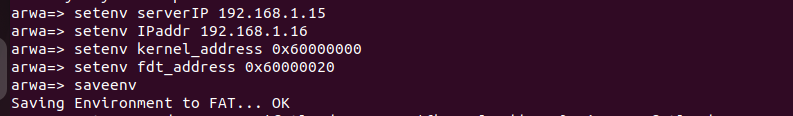
<br><br>
Define the command to load kernel and device tree from FAT:

```
setenv Load_From_FAT 'fatload mmc 0:1 ${kernel_address} Zimage; fatload mmc 0:1 ${fdt_address} hardware.dtb'
saveenv
```

Define the command to load kernel and device tree from TFTP:

```
setenv Load_From_TFTP 'tftp ${kernel_address} Zimage; tftp ${fdt_address} hardware.dtb'
saveenv
```
<br><br>
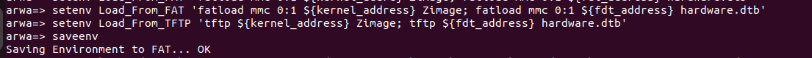
<br><br>
Set the boot command to load from FAT or TFTP:

```
setenv bootcmd 'echo "Arwa"; if run Load_From_FAT; then echo "Loaded from FAT"; elif run Load_From_TFTP; then echo "Loaded from TFTP"; fi; bootd'
saveenv
```
<br><br>
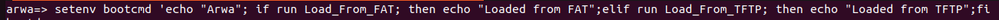
<br><br>

Now, your TFTP server is set up, and U-Boot is configured for network booting using either FAT or TFTP. Ensure that your kernel and device tree files are correctly placed in the TFTP server directory.

in case there is zimage and hardware.dtb files in /boot directory:

<br><br>
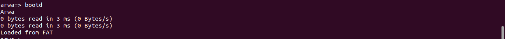
<br><br>

otherwise

<br><br>
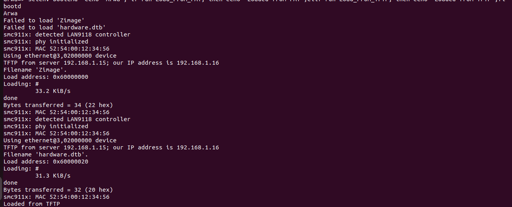
<br><br>

Congratulations! You have successfully set up a TFTP server and configured U-Boot for network booting.

