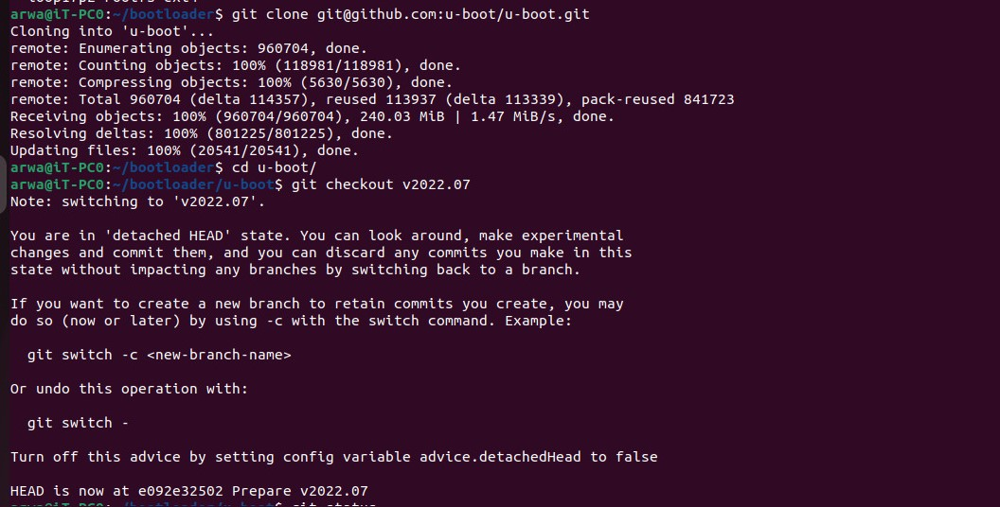
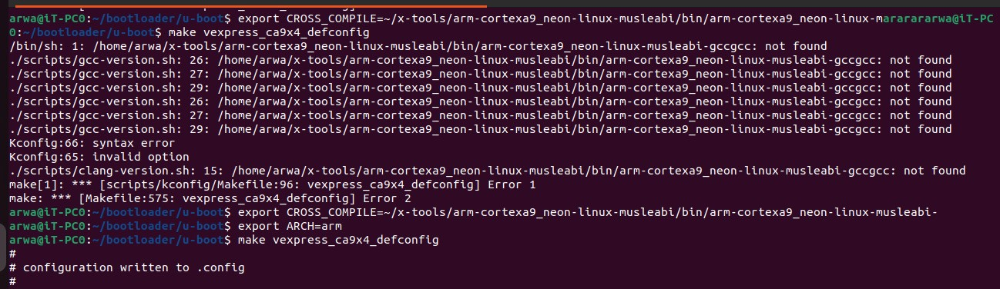
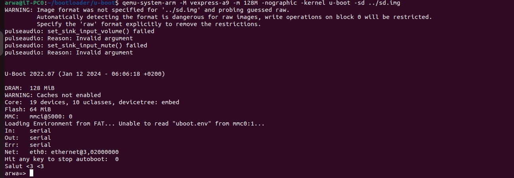
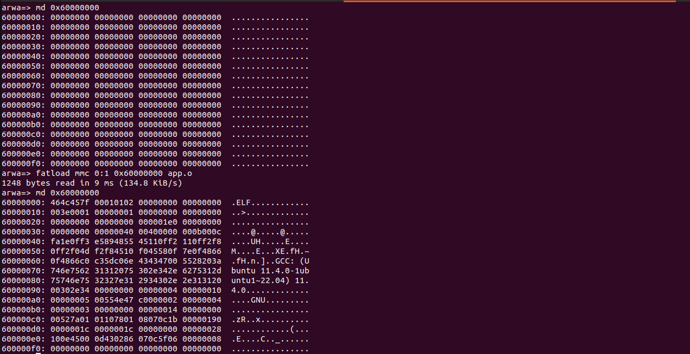

# Running U-Boot and Flashing Binary

This guide will walk you through the steps to run U-Boot and flash a binary using `fatload` on RAM address `0x6000000` automatically after the autoboot ends.

## Prerequisites

Before you begin, make sure you have the following:

- Git installed on your system
- Cross-compiler toolchain for ARM Cortex-A9 Neon Linux Musleabihf
- QEMU system emulator installed
- `libssl-dev` package installed

## Steps

1. Clone the U-Boot repository:

    ```bash
    git clone git@github.com:u-boot/u-boot.git
    ```

2. Change to the U-Boot directory:

    ```bash
    cd u-boot/
    ```

3. Checkout the desired U-Boot version (e.g., v2022.07):

    ```bash
    git checkout v2022.07
    ```
    cp boot4 u-boot/

    <br> <br>
      
   <br> <br>

4. List the available machine configurations:

    ```bash
    ls configs/ | grep [your machine]
    ```

5. List the available defconfig files:

    ```bash
    ls configs/ | grep vexpress_ca9x4_defconfig
    ```

6. Set the CROSS_COMPILE environment variable to the path of your cross-compiler:

    ```bash
    export CROSS_COMPILE=path/to/cross/compiler/arm-cortexa9_neon-linux-musleabihf-
    ```

7. Set the ARCH environment variable to `arm`:

    ```bash
    export ARCH=arm
    ```

8. Configure U-Boot using the vexpress_ca9x4_defconfig:

    ```bash
    make vexpress_ca9x4_defconfig
    ```

9. Customize the U-Boot configuration:

    ```bash
    make menuconfig
    ```
   <br> <br>
    
   <br> <br>
10. Build U-Boot:

     ```bash
     make
     ```

11. Install the `libssl-dev` package:

     ```bash
     sudo apt-get install libssl-dev
     ```

12. Install the QEMU system emulator:

     ```bash
     sudo apt install qemu-system-arm
     ```

13. Check the installed version of QEMU system emulator:

     ```bash
     qemu-system-arm --version
     ```

14. Check if the `qemu-system-arm` package is installed:

     ```bash
     dpkg -l | grep qemu-system-arm
     ```

15. Copy the `boot4` image to the U-Boot directory:

    ```bash
    cp boot4 u-boot/
    ```

15. Run U-Boot using QEMU with the vexpress-a9 machine and 128MB of RAM:

     ```bash
     qemu-system-arm -M vexpress-a9 -m 128M -nographic -kernel path/u-boot -sd path/sd.img
     ```

     Replace `path/u-boot` with the path to your U-Boot binary and `path/sd.img` with the path to your SD card image.


   <br> <br>
    
   <br> <br>
16. Flash the binary using `fatload` on RAM address `0x6000000`:

     ```bash
     fatload mmc 0:1 0x6000000 <binary_file>
     ```
     <br> <br>
    
     <br> <br>

     Replace `<binary_file>` with the name of your binary file.

That's it! You have successfully run U-Boot and flashed a binary using `fatload` on RAM address `0x6000000` automatically after the autoboot ends.
