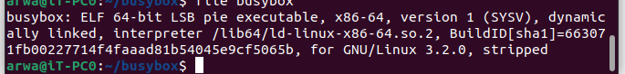
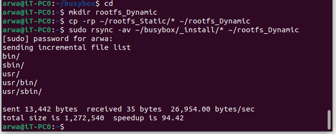
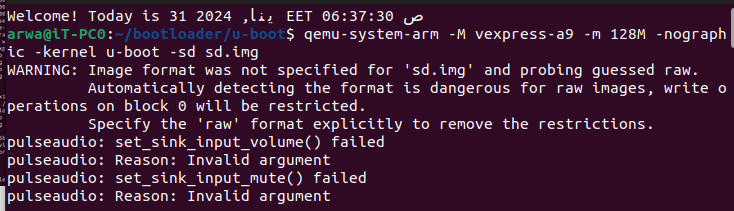
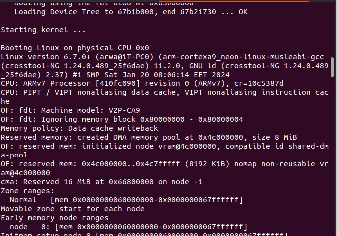
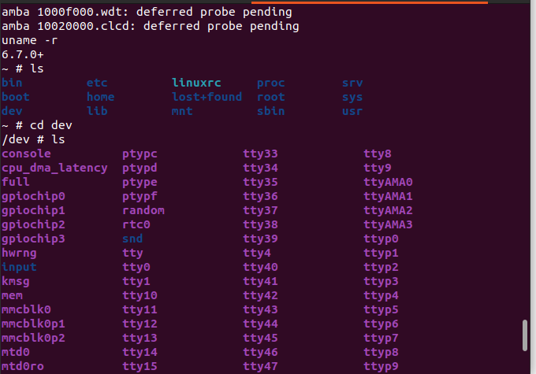

## Building Busybox Dynamically

This file demonstrates the process of building Busybox dynamically. It includes the following steps:

1. Set the environment variables `CROSS_COMPILE` and `ARCH` for cross-compilation.
2. Run `make menuconfig` to configure the build options.
3. Deselect the "Build static library" option in the "Settings -> Build option" menu.
4. Run `make` to build Busybox.
5. Run `make install` to install Busybox.
6. Create a directory named `rootfs_Dynamic`.
7. Copy the contents of the `_install` directory to the `rootfs_Dynamic` directory.
8. Create the necessary directories (`boot`, `dev`, `etc`, `home`, `mnt`, `proc`, `root`, `srv`, `sys`) inside the `rootfs_Dynamic` directory.
9. Copy the `lib` directory from the cross-compilation toolchain's sysroot to the `rootfs_Dynamic` directory.
10. Copy the `usr/lib` and `usr/include` directories from the cross-compilation toolchain's sysroot to the `rootfs_Dynamic/usr` directory.
11. Create the `etc/init.d` directory inside the `rootfs_Dynamic` directory.
12. Create a file named `rcS` inside the `etc/init.d` directory and add the necessary script to mount filesystems and set permissions.
13. Edit the `inittab` file inside the `rootfs_Dynamic/etc` directory to configure the system startup and console behavior.
14. Change the ownership of the `rootfs_Dynamic` directory to `root:root`.
15. Mount the target disk to `/media/arwa/rootfs/` using the `sudo mount` command.
16. Copy the contents of the `rootfs_Dynamic` directory to the mounted disk.
17. Change to the `bootloader/u-boot` directory.
18. Run the QEMU emulator with the specified parameters to boot the kernel and device tree.
19. Load the kernel image (`zImage`) and device tree blob (`vexpress-v2p-ca9.dtb`) from the SD card.
20. Boot the kernel with the specified parameters.

## Building Busybox Dynamically

```
export CROSS_COMPILE=~/x-tools/arm-cortexa9_neon-linux-musleabi/bin/arm-cortexa9_neon-linux-musleabi-
export ARCH=arm
```
```
make menuconfig
```
deselect 
Settings-> Build option -> build static library
```
make
```
```
make install
```



```
cd
mkdir rootfs_Dynamic
```


```
cp -rp ~/busybox/_install/* ~/rootfs_Dynamic/
cd rootfs_Dynamic
```
```
mkdir boot dev etc home mnt proc root srv sys
cd ~/x-tools/arm-cortexa9_neon-linux-musleabi/arm-cortexa9_neon-linux-musleabi/sysroot
```
```
cp -rp ./lib/ ~/rootfs_Dynamic/
cp -rp ./usr/lib/ ~/rootfs_Dynamic/usr/
cp -rp ./usr/include/ ~/rootfs_Dynamic/usr/
cd ~/rootfs_Dynamic
```
```
mkdir etc/init.d
vim etc/init.d/rcS
```

```

#!/bin/sh
# mount a filesystem of type `proc` to /proc
mount -t proc nodev /proc
# mount a filesystem of type `sysfs` to /sys
mount -t sysfs nodev /sys
# mount devtmpfs if you forget to configure it in Kernel menuconfig

 mount -t devtmpfs devtempfs /dev
 ```

```
 chmod +x etc/init.d/rcS
 ```

```
cd ~/rootfs_Dynamic/etc
vim inittab
```
```
# inittab file 
#-------------------------------------------------------
#When system startup,will execute "rcS" script
::sysinit:/etc/init.d/rcS
#Start"askfirst" shell on the console (Ask the user firslty to press any key) 
ttyAMA0::askfirst:-/bin/sh
#when restarting the init process,will execute "init" 
::restart:/sbin/init 
```
```
sudo chown -R root:root ~/rootfs_Dynamic
sudo mount -o rw ${DISK} /media/arwa/rootfs/
```

```
sudo cp -rp ~/rootfs_Dynamic/* /media/arwa/rootfs
cd ~/bootloader/u-boot
```
```
qemu-system-arm -M vexpress-a9 -m 128M -nographic -kernel u-boot -sd sd.img
```


```
fatload mmc 0:1 $Zimag_RAM_Add zImage

fatload mmc 0:1 $dtb_hardware_Add vexpress-v2p-ca9.dtb
bootz $Zimag_RAM_Add - $dtb_hardware_Add
```<br><br>

<br><br>
<br><br>


<br><br>
