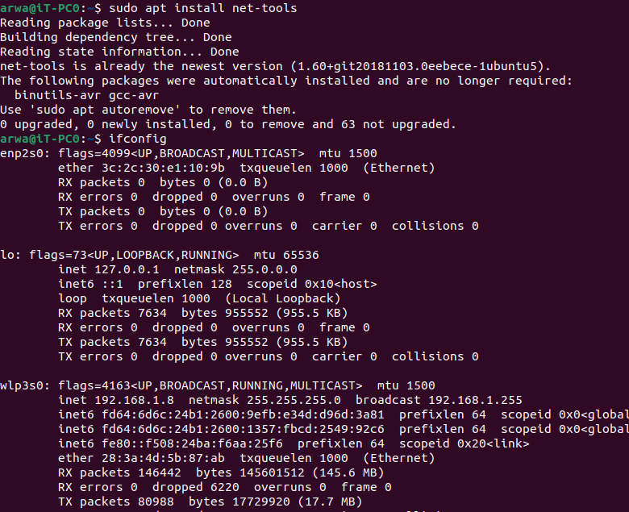

# Busybox via NFS

This guide explains how to set up Busybox via NFS on Debian.

## Installation

1. Install NFS Debian Package:
    ```
    sudo apt install nfs-kernel-server
    ```
 <br><br>

<br><br>

2. Check if NFS is installed successfully:
    ```
    systemctl status nfs-kernel-server
    ss -tulpen | grep 2049
    lsmod | grep nfs
    ```

3. Configure NFS exports:
    ```
    sudo vim /etc/exports
    ```
    Add the following line:
    ```
    /srv/nfs-share  *(rw,sync,no_subtree_check,no_root_squash)
    ```

4. Create the NFS share directory:
    ```
    sudo mkdir /srv/nfs-share
    ```

5. Copy the necessary files to the NFS share directory:
    ```
    sudo cp -rp ~/rootfs_Dynamic/* /srv/nfs-share
    ```

6. Install net-tools package:
    ```
    sudo apt install net-tools
    ```

## Usage

1. Check the IP address of the machine:
    ```
    ifconfig
    ```
<br><br>

<br><br>

2. Ping the NFS server:
    ```
    ping 192.168.1.100
    ```
 <br><br>

<br><br>

3. Restart the NFS server:
    ```
    sudo systemctl restart nfs-kernel-server
    ```

4. Alternatively, you can use the following command to refresh the NFS exports:
    ```
    sudo exportfs -r
    ```
  <br><br>

<br><br>
5. Verify that the NFS server is running:
    ```
    ps -ef | grep nfs
    ```

6. Change to the bootloader/uboot directory:
    ```
    cd bootoader/uboot
    ```

7. Start the QEMU emulator with the specified parameters:
    ```
    sudo qemu-system-arm -M vexpress-a9 -m 128M -nographic -kernel u-boot -sd sd.img -net tap,script=./qemu-ifup -net nic
    ```
  <br><br>

<br><br>
8. Set the environment variables:
    ```
# Set the IP address of the NFS server
    setenv serverip 192.168.1.8  

# Set the IP address of the beaglebone
    setenv ipaddr 192.168.1.100  

# Set the boot arguments for the kernel
    setenv bootargs 'console=ttyAMA0  root=/dev/nfs ip=192.168.1.100:::::eth0 nfsroot=192.168.1.8:/srv/nfs-share,nfsvers=3,tcp rw init=/sbin/init'  

 # Set the RAM address for the kernel image
    setenv Zimag_RAM_Add 60000000 

 # Set the address for the device tree binary
    setenv dtb_hardware_Add 65000000 

# Save the environment variables to the U-Boot environment
    saveenv 

# Set the boot command to load the kernel image and device tree blob from the TFTP server
    setenv bootcmd "echo "Arwa!"; tftp $Zimag_RAM_Add zImage;tftp $dtb_hardware_Add vexpress-v2p-ca9.dtb"  

# Boot the kernel with the specified RAM address and device tree blob address
    bootz $Zimag_RAM_Add - $dtb_hardware_Add  
    ```
      <br><br>

<br><br>

  <br><br>

<br><br>

