## Building Busybox statically 

This file demonstrates the process of setting up and configuring BusyBox on a Linux system. It includes the following steps:

1. Cloning the BusyBox repository from GitHub.
2. Navigating to the cloned repository.
3. Setting the cross-compile environment variables.
4. Running the `make menuconfig` command to configure the build options.
5. Selecting the "build static library" option in the build settings.
6. Building BusyBox using the `make` command.
7. Installing BusyBox using the `make install` command.
8. Creating a directory for the static root file system.
9. Copying the contents of the BusyBox installation to the static root file system.
10. Creating necessary directories in the static root file system.
11. Creating a script file `rcS` in the `etc/init.d` directory.
12. Mounting the `proc`, `sysfs`, and `devtmpfs` file systems.
13. Setting the executable permission for the `rcS` script.
14. Editing the `inittab` file to specify the startup script and console settings.
15. Changing the ownership of the static root file system to root.
16. Creating a loop device for the SD card image.
17. Formatting the boot and root file system partitions on the SD card image.
18. Mounting the root file system partition.
19. Copying the contents of the static root file system to the SD card image.
20. Mounting the boot partition.
21. Copying the Linux kernel image and device tree files to the boot partition.
22. Changing to the U-Boot bootloader directory.
23. Running the QEMU emulator with the specified parameters.
24. Setting the U-Boot environment variables.
25. Loading the kernel image and device tree files into RAM.
26. Booting the system.
27. Checking the kernel version.

## steps


# Clone the BusyBox repository from GitHub
```
git clone https://github.com/mirror/busybox.git
```


# Navigate to the cloned repository
```
cd busybox
```


# Set the cross-compile environment variables
```
export CROSS_COMPILE=~/x-tools/arm-cortexa9_neon-linux-musleabi/bin/arm-cortexa9_neon-linux-musleabi-

export ARCH=arm
```
<br><br>
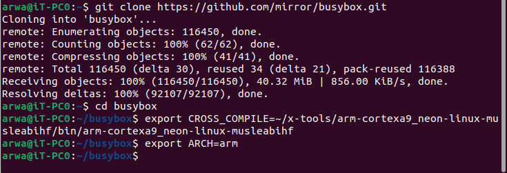
<br><br>

# Configure the build options using `make menuconfig`
```
make menuconfig
```


# Select the "build static library" option in the build settings

# Build BusyBox

```
make
```
<br><br>

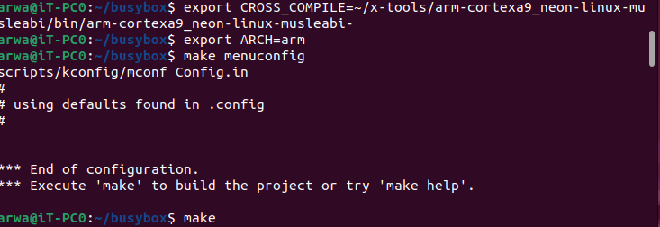
<br><br>


# Install BusyBox
```
make install
```
<br><br>

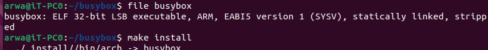
<br><br>
<br><br>

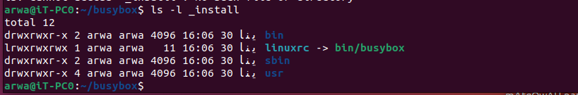
<br><br>


# Create a directory for the static root file system
```
cd
mkdir rootfs_Static
```
<br><br>

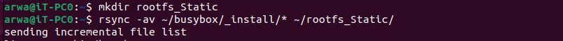
<br><br>

# Copy the contents of the BusyBox installation to the static root file system
```
rsync -av ~/busybox/_install/* ~/rootfs_Static/
<br><br>

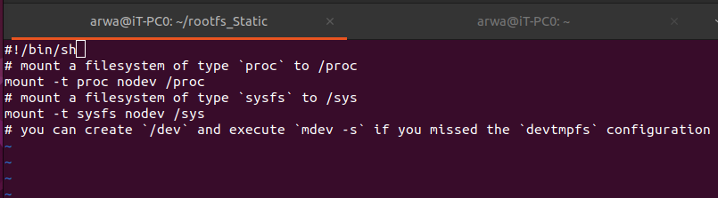
<br><br>

# Copy additional files to the static root file system
cp -rp ~/rootfs/* ~/rootfs_Static

# Create necessary directories in the static root file system
cd rootfs_Static
mkdir boot dev etc home mnt proc root srv sys
mkdir etc/init.d

# Create and edit the `rcS` script file
vim etc/init.d/rcS
```
<br><br>
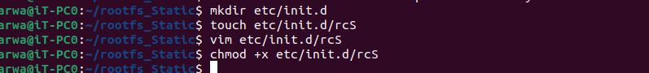
<br><br>

```

#!/bin/sh
# mount a filesystem of type `proc` to /proc
mount -t proc nodev /proc
# mount a filesystem of type `sysfs` to /sys
mount -t sysfs nodev /sys
# mount devtmpfs if you forget to configure it in Kernel menuconfig

 mount -t devtmpfs devtempfs /dev
 <br><br>
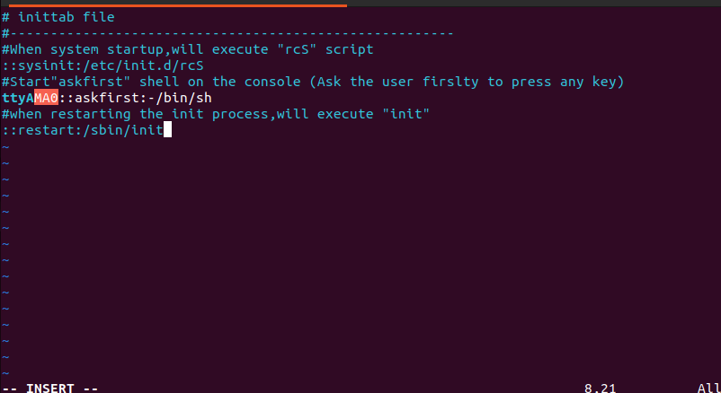
<br><br>

 ```
# Set the executable permission for the `rcS` script
```
chmod +x etc/init.d/rcS
```

# Edit the `inittab` file
```
vim etc/inittab
```

```
# inittab file 
#-------------------------------------------------------
#When system startup,will execute "rcS" script
::sysinit:/etc/init.d/rcS
#Start"askfirst" shell on the console (Ask the user firslty to press any key) 
ttyAMA0::askfirst:-/bin/sh
#when restarting the init process,will execute "init" 
::restart:/sbin/init 
```
<br><br>

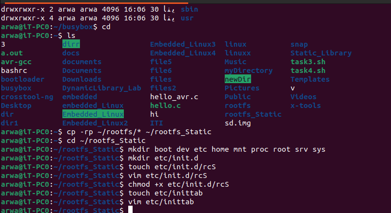
<br><br>

# Change the ownership of the static root file system to root
```
sudo chown -R root:root ~/rootfs_Static
```
<br><br>
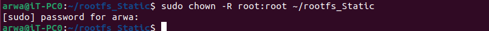
<br><br>

# Create a loop device for the SD card image
```
sudo losetup -f --show --partscan sd.img
```
<br><br>
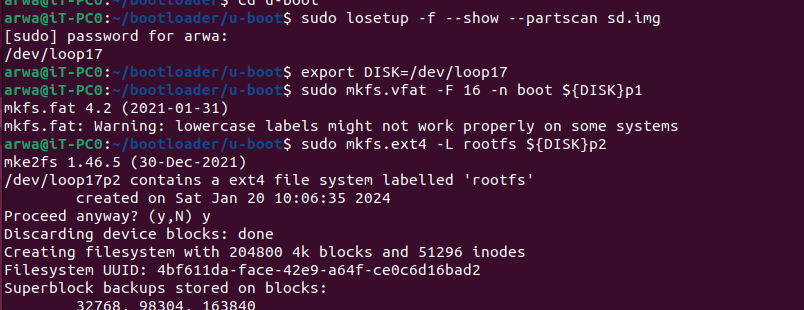
<br><br>

# Format the boot and root file system partitions on the SD card image
```
export DISK=/dev/loop<x>
sudo mkfs.vfat -F 16 -n boot ${DISK}p1
sudo mkfs.ext4 -L rootfs ${DISK}p2
```

# Mount the root file system partition
```
sudo mkdir /media/arwa/rootfs
sudo mount -o rw /${DISK}p2 /media/arwa/rootfs
```

# Copy the contents of the static root file system to the SD card image
```
cp -rp ~/rootfs_Static/* /media/arwa/rootfs
```
<br><br>
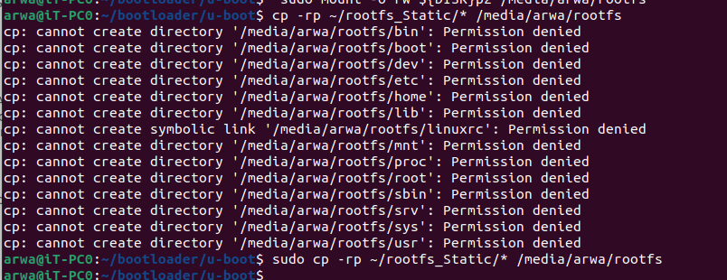
<br><br>


# Mount the boot partition
```
sudo mount -o rw /${DISK}p1 /media/arwa/boot
```

# Copy the Linux kernel image to the boot partition
```
sudo cp  ~/linux/arch/arm/boot/zImage /media/arwa/boot/
```
# or
```
sudo cp  /srv/tftp/zImage /media/arwa/boot/
```

# Copy the device tree files to the boot partition
```
sudo cp ~/linux/arch/arm/boot/dts/arm/*-ca9.dtb /media/arwa/boot
```
# or
```
sudo cp /srv/tftp/*-ca9.dtb /media/arwa/boot
```
<br><br>
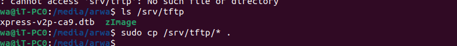
<br><br>

# Change to the U-Boot bootloader directory
```
cd ~/bootloader/u-boot
```

# Run the QEMU emulator with the specified parameters
```
qemu-system-arm -M vexpress-a9 -m 128M -nographic -kernel u-boot -sd sd.img
```


<br><br>
# Set the U-Boot environment variables
```
setenv bootargs 'console=ttyAMA0 root=/dev/mmcblk0p2 rootfstype=ext4 rw rootwait init=/sbin/init' 
setenv Zimag_RAM_Add 0x60000000
setenv dtb_hardware_Add 0x65000000
```

# Load the kernel image and device tree files into RAM
```
fatload mmc 0:1 $Zimag_RAM_Add zImage
fatload mmc 0:1 $dtb_hardware_Add vexpress-v2p-ca9.dtb
```

# Boot the system
```
bootz $Zimag_RAM_Add - $dtb_hardware_Add

# Check the kernel version
uname -r
```
<br><br>
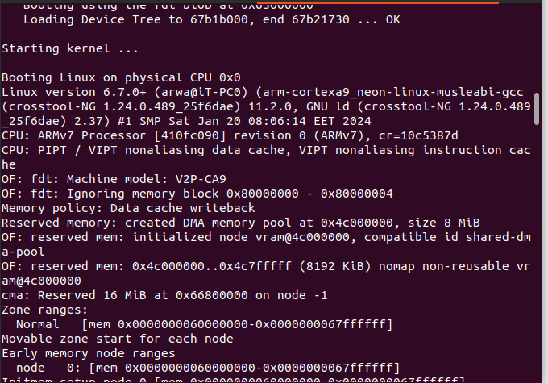
<br><br>
<br><br>

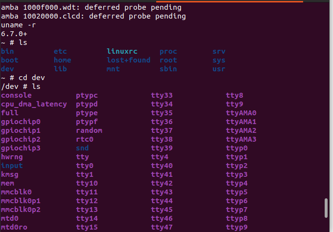
<br><br>
