# Linux Kernel

These commands provide a step-by-step guide for configuring and building the Linux kernel. It covers the following tasks:

1. Cloning the Linux kernel repository.
2. Configuring the kernel to the vexpress architecture.
3. Building the kernel and modules.
4. Running the kernel using QEMU.

The file is accompanied by screenshots that illustrate the different steps.

Please note that the paths and commands mentioned in the code may need to be adjusted based on your specific setup.

Follow the instructions carefully to successfully build and run the Linux kernel.
Linux Kernel

##  Clone the Linux Kernel Repository

```
git clone --depth=1 git://git.kernel.org/pub/scm/linux/kernel/git/stable/linux.git
```
<br><br>
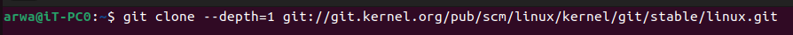
<br><br>

## Navigate to the Linux Kernel Directory
```
cd linux
```
# configure the kernel to vexpress

```
make ARCH=arm vexpress_defconfig
```

<br><br>

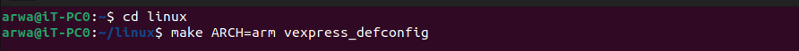
<br><br>

# To indentify your kernel version 
```
make ARCH=arm kernelversion
```

Configure Kernel

# export the compiler
```
export CROSS_COMPILE=PathToCompiler/arm-linux-cortexa9Compiler
```

# export the architecture used
```
export ARCH=arm
```

<br><br>

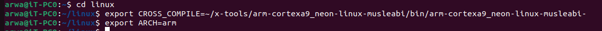
<br><br>

# configure the kernel with the required configuration 
```
make menuconfig
```

<br><br>


<br><br>

# build the kernel
```
make -j4 zImage modules dtbs
make -j4 ARCH=arm CROSS_COMPILE=arm-cortex_a8-linux-gnueabihf- INSTALL_MOD_PATH=$HOME/rootfs 
```
modules_install
<br><br>

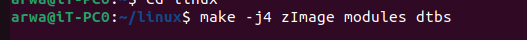
<br><br>

# OPTIONAL
# To emulate the sd.img file as a sd card we need to attach it to loop driver to be as a block storage


# attach the sd.img to be treated as block storage
```
sudo losetup -f --show --partscan sd.img
```

 Running the upper command will show you
 Which loop device the sd.img is connected
 take it and assign it like down bellow command

 Assign the Block device as global variable to be treated as MACRO
```
export DISK=/dev/loop<x>
```

Format Partition Table
As pre configured from cfdisk command first partition is FAT

# Formating the first partition as FAT

```
sudo mkfs.vfat -F 16 -n boot ${DISK}p1
```

As pre configured from cfdisk Command second partition is linux

# format the created partition by ext4
```
sudo mkfs.ext4 -L rootfs ${DISK}p2
```

<br><br>

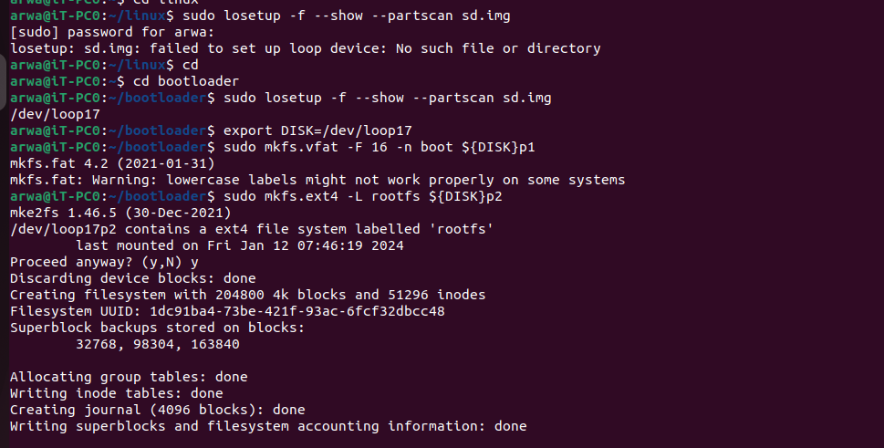
<br><br>

# Mounting the partitions
copy the kernel to the boot directory
```
cp linux/arch/arm/boot/zImage /boot/
cp linux/arch/arm/boot/dts/arm/*-ca9.dtb /boot/
```

```
cp linux/arch/arm/boot/zImage /srv/tftp
```

<br><br>

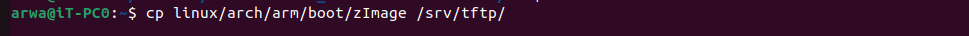
<br><br>
```
cp linux/arch/arm/boot/dts/arm/*-ca9.dtb /srv/tftp
```

<br><br>

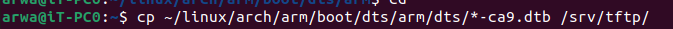
<br><br>

# Run QEMU with the Configured Kernel
```
sudo qemu-system-arm -M vexpress-a9 -m 128M -nographic -kernel path/u-boot -sd path/sd.img -net tap,script=./qemu-ifup -net nic
```

# U-Boot Configuration
```
setenv serverip 192.168.1.15
saveenv

setenv ipaddr 192.168.1.16 
saveenv

setenv kernel_address 0x60000000
saveenv

setenv fdt_address 0x6500000
saveenv
```

<br><br>

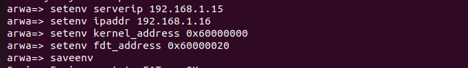
<br><br>
```
setenv bootargs console=ttyAMA0
saveenv
```

# Define the command to load kernel and device tree from FAT:
```
setenv Load_From_FAT 'fatload mmc 0:1 ${kernel_address} Zimage; fatload mmc 0:1 ${fdt_address}  vexpress-v2p-ca9.dtb'
saveenv
```

# Define the command to load kernel and device tree from TFTP:
```
setenv Load_From_TFTP 'tftp ${kernel_address} Zimage; tftp ${fdt_address} vexpress-v2p-ca9.dtb'
saveenv
```

<br><br>

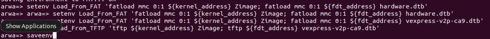
<br><br>


# Load Kernel and Device Tree
```
tftp ${kernel_address} zImage
```

<br><br>

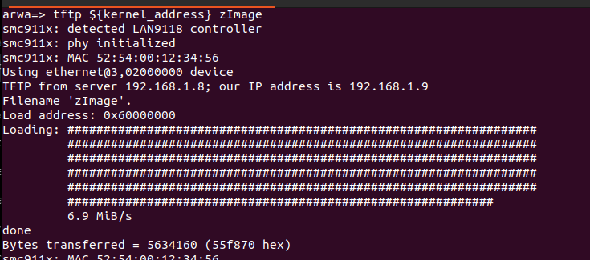
<br><br>
```
tftp ${fdt_address} vexpress-v2p-ca9.dtb
```

<br><br>

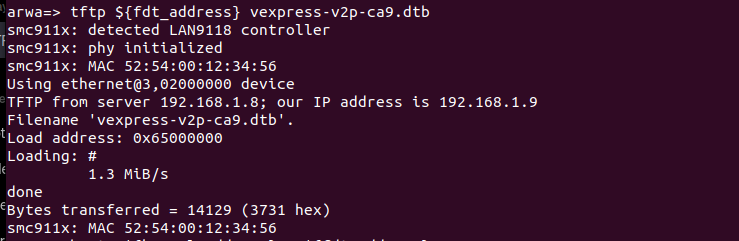
<br><br>

# Boot the Kernel
```
bootz ${kernel_address} - ${fdt_address}
```

<br><br>

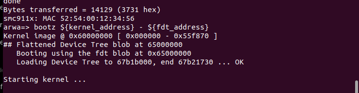
<br><br>
<br><br>

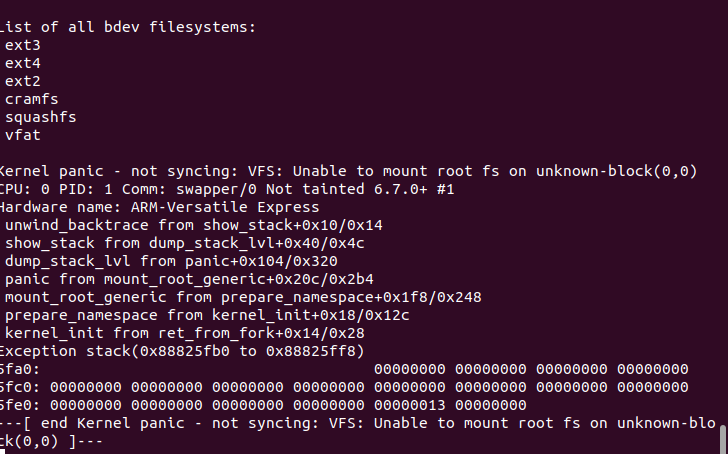
<br><br>

# Congratulations! You have successfully configured, built, and booted the Linux kernel using QEMU. 