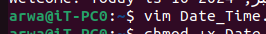
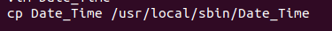
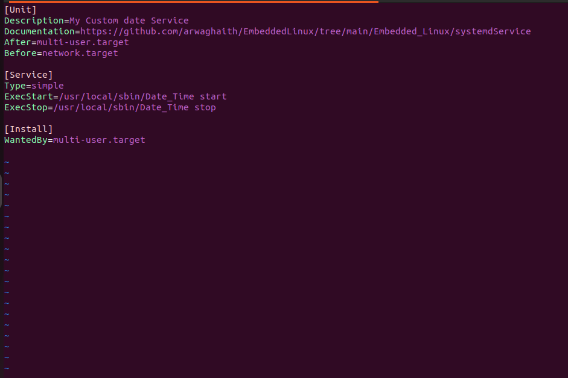
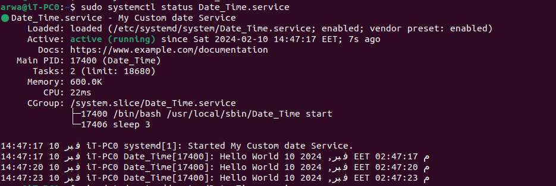

## A unit service

This file selection includes a bash script and a systemd service file for a custom date service.

The bash script defines two functions: `hellostart()` and `hellostop()`. The `hellostart()` function continuously prints "Hello World" along with the current date and time using the `date` command, and then sleeps for 3 seconds. The `hellostop()` function kills all instances of the script.

The script also includes a case statement that checks the command-line argument passed to the script. If the argument is "start", it calls the `hellostart()` function. If the argument is "stop", it calls the `hellostop()` function.

The systemd service file (`Date_Time.service`) is used to manage the execution of the bash script as a service. It specifies that the service should be started after the multi-user target and before the network target. The `ExecStart` directive specifies the command to start the service, and the `ExecStop` directive specifies the command to stop the service.

To use the service, the script needs to be made executable using the `chmod +x` command. Then, the service file needs to be created or edited using a text editor (e.g., `sudo vim Date_Time.service`) and the appropriate paths and options should be set.

Finally, the systemd commands `sudo systemctl daemon-reload`, `sudo systemctl start Date_Time.service`, and `sudo systemctl status Date_Time.service` are used to reload the systemd configuration, start the service, and check its status, respectively.

```
vim Date_Time
```

<br>
<br>

<br>
<br>

```
#!/bin/bash

function hellostart(){
    while [ 1 ]
    do
        echo Hello World $(date)   # Print "Hello World" along with the current date
        sleep 3   # Pause the script execution for 3 seconds
    done
}

function hellostop()
{
    killall $(basename $0 )   # Kill all instances of the script itself
}

case "$1" in
    start)
        hellostart   # Call hellostart function when the script is started with "start" argument
        ;;
    stop)
        hellostop   # Call hellostop function when the script is started with "stop" argument
        ;;
esac

```

<br>
<br>

<br>
<br>

# Make the script executable

```
chmod +x Date_Time
```

<br>
<br>
<br>
<br>

# copy the file to /usr/local/sbin

```
cp Date_Time /usr/local/sbin/
```

<br>
<br>
<br>
<br>

# Open the service file for editing with root privileges

```
sudo vim Date_Time.service
```

<br>
<br>

<br>
<br>

# The following section describes the unit and provides information about the service

```
[Unit]
Description=My Custom date Service
Documentation=https://github.com/arwaghaith/EmbeddedLinux/tree/main/Embedded_Linux/systemdService
After=multi-user.target
Before=network.target

# The following section defines the service behavior
[ser ervice]
Type=simple
ExecStart=/usr/local/sbin/Date_Time start
ExecStop=/usr/local/sbin/Date_Time stop

# The following section defines the installation details
[Install]
WantedBy=multi-user.target
```

<br>
<br>

<br>
<br>

# Reload the systemd daemon to apply any changes made to unit files

<br><br>

```
sudo systemctl daemon-reload
```

# Start the Date\_Time service

<br><br>

```
sudo systemctl start Date_Time.service
```

<br>
<br>

<br>
<br>

# Check the status of the Date\_Time service

<br>

```
sudo systemctl status Date_Time.service
```

or <br>

```
journalctl -u Date_Time
```

# sudo systemctl status Date\_Time.service gives a quick summary of the current status of the service along with recent log messages, while journalctl -u Date\_Time provides access to the complete log history for the service.

<br>
<br>

<br>
<br>
