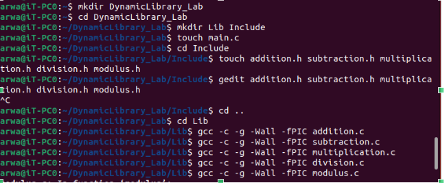
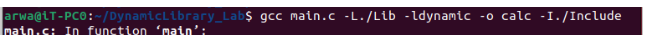
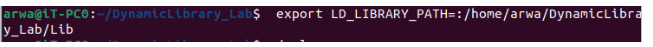
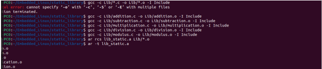
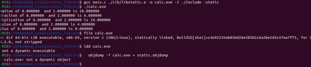

# EmbeddedLinux
# Dynamic and Static Linking

## Dynamic Linking

This lab demonstrates how to create and use a shared library in a C program.

## Prerequisites
- avr-gcc compiler

## Steps

1. First, create a library called `DynamicLibrary_Lab`.

2. Create two directories: `Include` and `Lib`.

3. Place the header files (`*.h`) in the `Include` directory and the source files (`*.c`) in the `Lib` directory.

4. Compile each source file (except `main.c`) using the following command:
  ```shell
  gcc -c -g -Wall -fPIC Lib/file.c
  ```


5. Create the shared library using the following command:
  ```shell
  gcc -shared -o libdynamic.so Lib/file.o ...
  ```


6. Compile and link the application with the shared library using the following command:
  ```shell
  gcc main.c -L./Lib -ldynamic -o calc -I./Include
  ```

 

7. Compile and link the application with the shared library using the same command as step 5.

8. Run the application:
  ```shell
  ./calc
  ```




<br>
<br>


--------------------------------------------------------------------------------------------------------------------------------------------------------------
---------------------------------------------------------------------------------------------------------------------------------------------------------------

# Static Linking

## Creating Libraries (Same as Dynamic Linking)

1. Compile each `file.c` (except `main.c` for now) using the following command:
    ```
    gcc -c file.c -o file.o
    ```

2. Archive the `.o` files into one library using the following command:
    ```
    ar rcs lib_static.a file1.o file2.o
    ```
    


3. Generate `main.o` to include the header library in the symbol table:
    ```
    gcc -c main.c -I ./Include
    ```

4. Generate the executable using the following command:
    ```
    gcc -o calc.exe main.o lib_static.a
    ```
     

   


<br>
<br>


