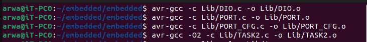
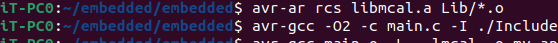
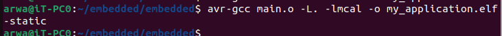

# Compiling the MCAL drivers

To develop a static library for an AVR application using MCAL drivers, follow these steps:

1. Compile the source files:
    ```bash
    avr-gcc -c PORT.c DIO.c PORT_cfg.c TASKSD.c
    ```
 

2. Archive the object files:
    ```bash
    avr-ar rcs libmcal.a PORT.o DIO.o PORT_cfg.o TASKSD.o
    ```
      <br>
    <br>

 
   <br>
    <br>

3. Generate the main object file:
    ```bash
    avr-gcc -c main.c -I/path/to/mcal/headers
    ```
  <br>
    <br>

4. Generate the application:
    ```bash
    avr-gcc -o application.elf main.o -L/path/to/mcal/library -lmcal
    ```
    <br>
<br>

 
     <br>
         <br>


Flashing the application.elf to ATmega32 on Proteus:
    <br>
    <br>

 
     <br>
    <br>


##Another solution using make 
```
# Makefile for AVR Project

# Compiler
CC = avr-gcc

# Compiler flags
CFLAGS = -O2 -I./Include

# Library
LIB = libmcal.a

# Source files for MCAL Library
MCAL_SRC = Lib/DIO.c Lib/PORT.c Lib/PORT_CFG.c Lib/TASK2.c
MCAL_OBJ = $(MCAL_SRC:.c=.o)

# Source files for Application
APP_SRC = main.c
APP_OBJ = $(APP_SRC:.c=.o)

# Target
TARGET = my_application.elf

# Build rules
all: $(TARGET)

$(TARGET): $(APP_OBJ) $(LIB)
	$(CC) $(CFLAGS) $^ -o $@

$(LIB): $(MCAL_OBJ)
	avr-ar rcs $@ $^

%.o: %.c
	$(CC) $(CFLAGS) -c $< -o $@

clean:
	rm -f $(MCAL_OBJ) $(APP_OBJ) $(TARGET) $(LIB)

.PHONY: all clean

```

