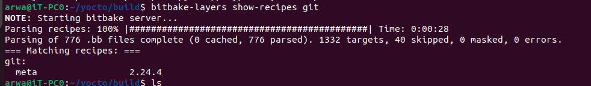
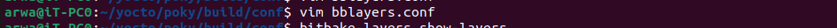
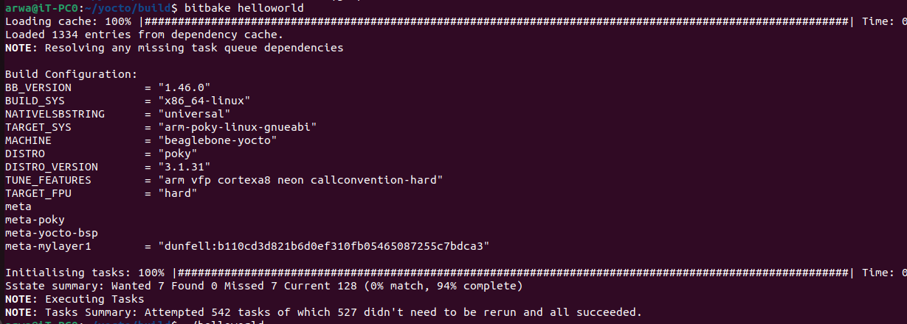

# Yocto Recipe

This repository contains instructions for setting up and building a Yocto Project recipe.

## Prerequisites

- [Poky](https://www.yoctoproject.org/software-item/poky/) - The reference distribution used by the Yocto Project.

## Setup

1. Source the `poky/oe-init-build-env` script to initialize the build environment.
    ```
    source poky/oe-init-build-env
    ```

<br><br>
    

<br><br>


2.navigate to the build directory:
    ```
    cd ~/yocto/poky/build
    ```
 3. Run the following command to show the layers:
    ```
    bitbake-layers show-layers
    ```
    <br><br>
    

<br><br>
4. Create a new layer:
    ```
    bitbake-layers create-layer /home/arwa/yocto/poky/meta-mylayer1
    ```


 <br><br>
    

<br><br>
5. Change directory to the new layer:
    ```
    cd ../meta-mylayer1
    ```

6. Add the new layer to the build configuration:
    ```
    bitbake-layers add-layer /home/arwa/yocto/poky/meta-mylayer1
    ```

     <br><br>
    

<br><br>

7. If the layer is not automatically added, open the `bblayers.conf` file:
    ```
    vim ~/yocto/poky/build/conf/bblayers.conf
    ```

    Add the path of the new layer to the file.

       <br><br>
    

<br><br>

8. Change directory to the recipe directory:
    ```
    cd ~/yocto/poky/meta-mylayer1/recipes-example
    ```

9. Create a new directory for the recipe:
    ```
    mkdir helloworld
    ```

10. Create a `files` directory inside the recipe directory:
    ```
    mkdir files
    ```

11. Create a `helloworld.bb` file inside the recipe directory:
    ```
    touch helloworld.bb
    ```

12. Change directory to the `files` directory:
    ```
    cd files
    ```

13. Create a `helloworld.c` file inside the `files` directory:
    ```
    touch helloworld.c
    ```

14. View the directory structure:
    ```
    tree
    ```
<br><br>
    

<br><br>
15. Check the value of the `COREBASE` variable for the `helloworld` recipe:
    ```
    bitbake -e helloworld | grep ^COREBASE=
    ```
    <br><br>
    

<br><br>

 <br><br>
    

<br><br>
16. Build the `helloworld` recipe:
    ```
    bitbake helloworld
    ```
<br><br>
    

<br><br>
