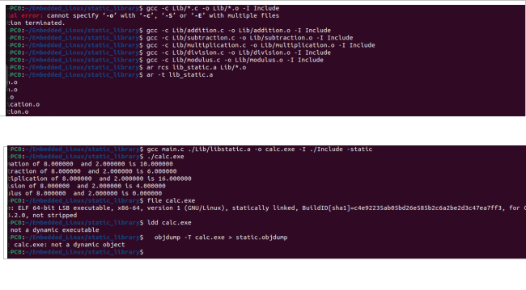

# EmbeddedLinux
This repository is for uploading  The assignments for an ITI course

1-Dynamic linking
-----------------------------------------------------------------------------------------------------
 
 

--------------------------------------------------------------------------------------------------------------------------------------------------------------
---------------------------------------------------------------------------------------------------------------------------------------------------------------

2-static linking
 
 

