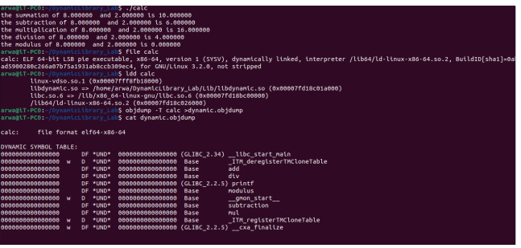

# EmbeddedLinux
This repository is for uploading  The assignments for an ITI course

# Dynamic Linking Lab

This lab demonstrates how to create and use a shared library in a C program.

## Prerequisites
- GCC compiler

## Steps

1. First, create a library called `DynamicLibrary_Lab`.

2. Create two directories: `Include` and `Lib`.

3. Place the header files (`*.h`) in the `Include` directory and the source files (`*.c`) in the `Lib` directory.

4. Compile each source file (except `main.c`) using the following command:
  ```shell
  gcc -c -g -Wall -fPIC Lib/file.c
  ```

5. Compile and link the application with the shared library using the following command:
  ```shell
  gcc main.c -L./Lib -ldynamic -o calc -I./Include
  ```

6. Create the shared library using the following command:
  ```shell
  gcc -shared -o libdynamic.so Lib/file.o ...
  ```

7. Compile and link the application with the shared library using the same command as step 5.

8. Run the application:
  ```shell
  ./calc
  ```





<br>
<br>


--------------------------------------------------------------------------------------------------------------------------------------------------------------
---------------------------------------------------------------------------------------------------------------------------------------------------------------

2-static linking
<br>
<br>


